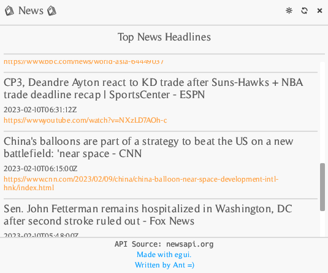
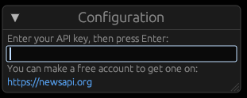

# News Headlines Frontend

This project is the rust standalone frontend GUI using eGUI which consumes my other project `news-api-backend`.

### Features

- Works on Win/OSX/Linux
- API Key and preference configs stored using `confy`
- Dark/Light mode switching and close app buttons
- Layout with a header, main scroll box and footer

### How To Use

- Pull this and the [backend project](https://github.com/AntSkilton/news-api-backend)
- Ensure your rust environment is setup
- `$ cargo run`
- Enter your API key in the GUI from newsapi.org
  

### Known Issues

- eGUI's hyperlink functions aren't working
- Refresh feed needs implementing
